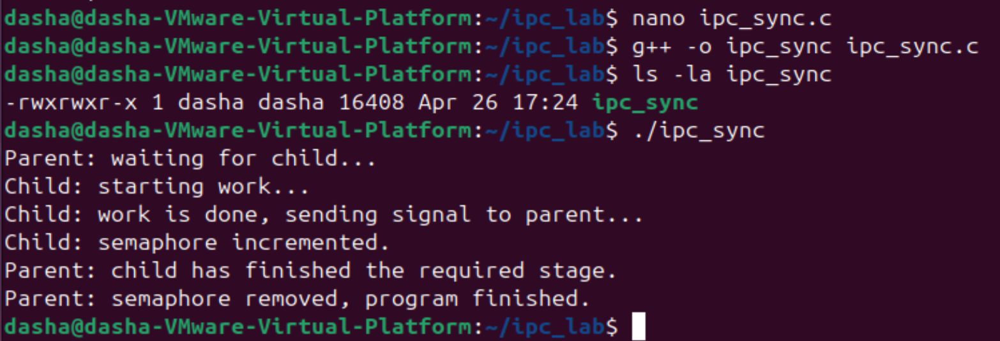

Программа демонстрирует синхронизацию родительского и дочернего процессов с помощью семафора System V в Linux.

# Как это работает
1. Родительский процесс создаёт семафор и инициализирует его значением 0.
2. После `fork()` дочерний процесс выполняет какую-нибудь работу.
3. Завершив работу, дочерний процесс увеличивает семафор (V-операция).
4. Родительский процесс ждёт на семафоре (P-операция), блокируясь до сигнала от дочернего.
5. После пробуждения родитель завершает работу и удаляет семафор.

# Результат выполнения

